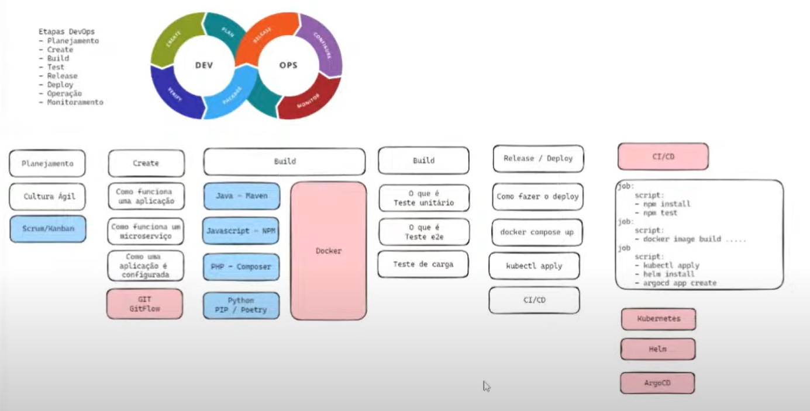

# DevOps

Um composto de Dev (desenvolvimento) e Ops (operações), o DevOps é a união de pessoas, processos e tecnologias para fornecer continuamente valor aos clientes.

O que o DevOps significa para as equipes? O DevOps permite que funções anteriormente isoladas – desenvolvimento, operações de TI, engenharia da qualidade e segurança – atuem de forma coordenada e colaborativa para gerar produtos melhores e mais confiáveis. Ao adotar uma cultura de DevOps em conjunto com as práticas e ferramentas de DevOps, as equipes ganham a capacidade de responder melhor às necessidades dos clientes, aumentar a confiança nos aplicativos que constroem e cumprir as metas empresariais mais rapidamente.

<https://azure.microsoft.com/pt-br/resources/cloud-computing-dictionary/what-is-devops/>

# Cheat Sheet principais ferramentas / tecnologias

<https://github.com/julianorib/cheat>

# Conteúdo de estudos resumido para uso pessoal.

- [Ansible](ansible/README.md)
- [CI-CD](ci-cd/README.md)
- [Docker](docker/README.md)
- [Git](git/README.md)
- [Helm](helm/README.md)
- [Kubernetes](kubernetes/README.md)
- [Observabilidade](observabilidade/readme.md)
- [QA](qa/readme.md)
- [Terraform](terraform/README.md)

