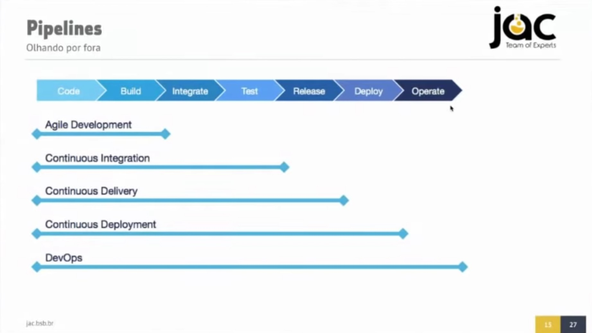
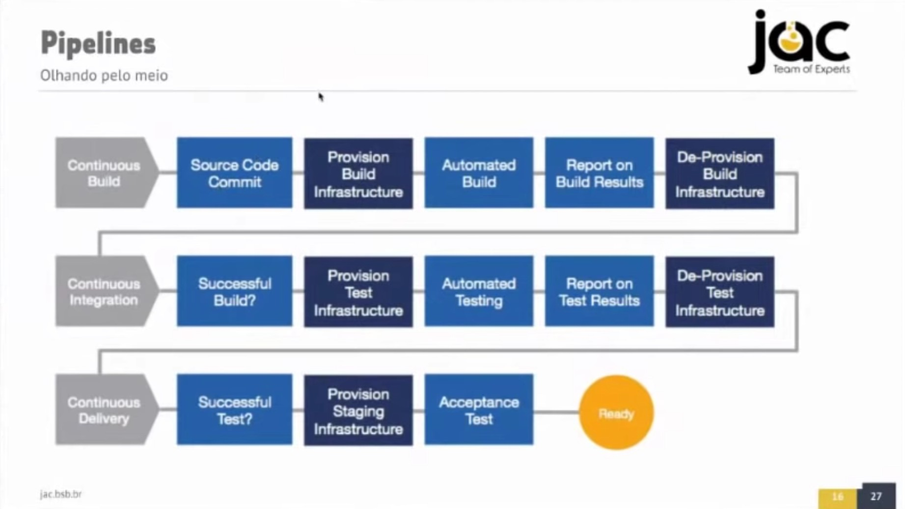
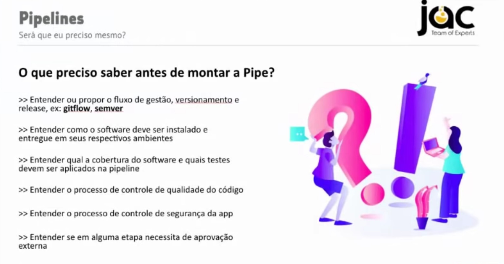
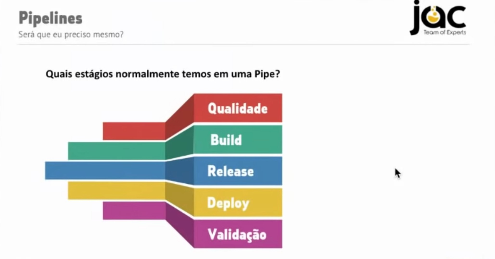
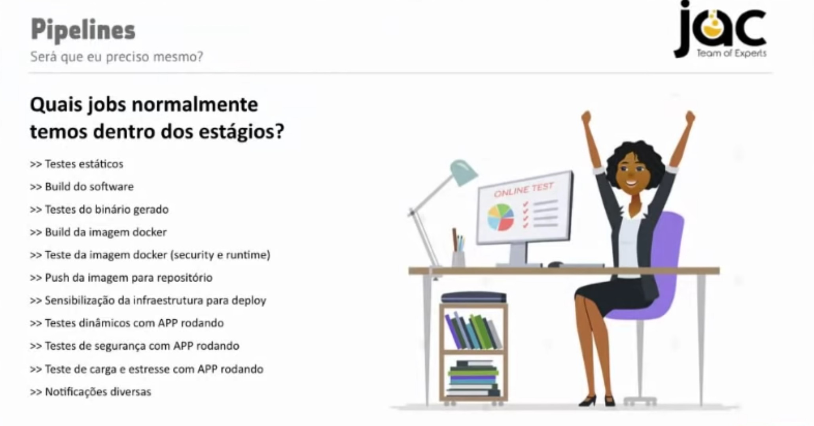
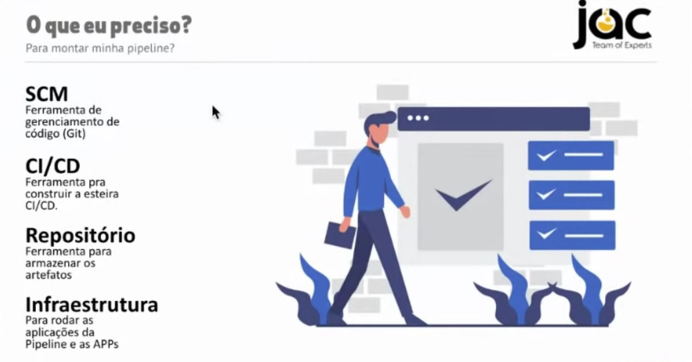
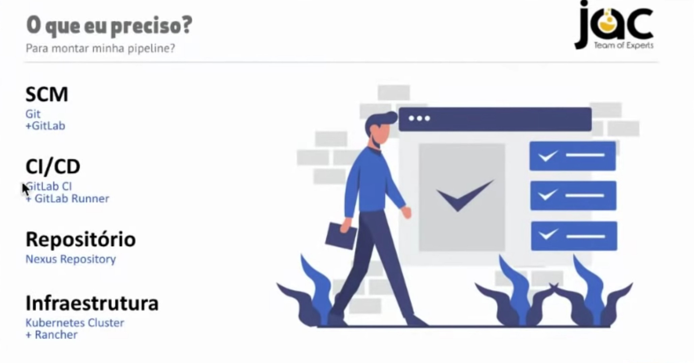

# Pipelines CI/CD

Agradecer primeiramente ao Guto Carvalho por criar este material e disponibilizar gratuitamente.

Copiei alguns slides, explicando sobre o que é uma pipeline.

## Estudos

Criei um projeto simples somente para execução via pipelines.\
<https://github.com/julianorib/meuapp>

Neste projeto, há uma pipeline para Jenkins e uma pipeline para Gitlab.\
Em ambas, é feito build e push para Registry Docker, e Deploy no Kubernetes.\
Deve-se criar as variáveis de autenticação.