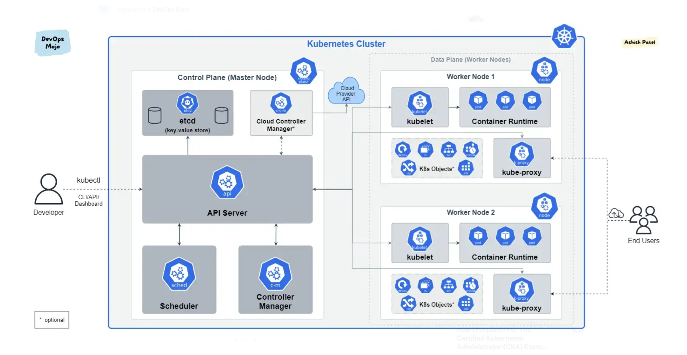

# Kubernetes / K8S

Livro Online:

https://livro.descomplicandokubernetes.com.br/pt/

Documentação Oficial:

https://kubernetes.io/pt-br/docs/home/


## Conceitos

 - Nó ou Worker
Cada Servidor de um Cluster

- Cluster 
Um conjunto de Nós que formam um Cluster

- Control Plane
Os componentes do plano de controle tomam decisões globais sobre o cluster (por exemplo, agendamento), bem como detectam e respondem a eventos de cluster (por exemplo, iniciando um novo POD quando o campo de uma implantação não estiver satisfeito)

- POD
Um container ou um conjunto de Containers com a mesma função

- kubeadm 
Tool para realizar o bootstrap do Cluster

- kubelet
tool que roda em todos os nodes gerenciando os papéis, iniciando pods, containers e mantendo-os saudáveis

- kubectl
tool para realizar a comunicação com o Cluster e executar todas as operações de orquestração.


## Cluster Kubernets Componentes



https://kubernetes.io/docs/concepts/overview/components/

## Componentes Control Plane

- Kube-apiserver
- etcd
- kube-scheduler
- kube-controller-manager
- cloud-controller-manager

## Componentes do Node

- Kubelet
- Kube-proxy
- Container Runtime


## Certificações:

- CKA
- CKS
- CKD


## Explicando cada componente

### Pods

https://kubernetes.io/docs/concepts/workloads/pods/

Os pods são as menores unidades implantáveis ​​de computação que você pode criar e gerenciar no Kubernetes.

Um pod é semelhante a um conjunto de contêineres com namespaces compartilhados e volumes de sistema de arquivos compartilhados

Quando Usar?
Você raramente criará pods individuais diretamente no Kubernetes, até mesmo pods singleton. Isso ocorre porque os pods são projetados como entidades relativamente efêmeras e descartáveis.

#### Comandos:
```
kubectl get pods
kubectl get pods -o wide
kubectl describe pods
kubectl delete pod nomepod
```

### ReplicaSet

https://kubernetes.io/pt-br/docs/concepts/workloads/controllers/replicaset/

O propósito de um ReplicaSet é gerenciar um conjunto de réplicas de Pods em execução a qualquer momento. Por isso, é geralmente utilizado para garantir a disponibilidade de um certo número de Pods idênticos.

#### Quando Usar? 
Basicamente nunca. 
Ele é aplicado em um nível superior com o Deployment.

#### Comandos:
```
kubectl get replicaset
kubectl describe replicaset
kubectl delete replicaset nomereplica
```

### Deployment

https://kubernetes.io/docs/concepts/workloads/controllers/deployment/

Um Deployment nada mais é do que uma camada acima de um ReplicaSet. Então, quando nós definimos um Deployment, nós estamos, automaticamente, definindo um ReplicaSet, sem nenhum mistério.

O propósito é criar implantações gerenciando atualizações sem interrupção juntamente com ReplicaSet que mantem um conjunto de réplicas definidas.
O Deployment consegue fazer um gerenciamento de versões do ReplicaSet. 
Com isso é possível fazer um Rolback / Rollout (reversão de atualização).

#### Quando usar?
Quase sempre.

#### Comandos:
```
kubectl get deployment
kubectl describe deployment
kubectl delete deployment nomedeploy
```
```
kubectl rollout history deployment nomedeploy

kubectl rollout undo deployment nomedeploy
kubectl rollout undo deployment nomedeploy --to-revision=2
```
```
kubectl scale deployment/nomedeploy --replicas 5
```

### Registry Privado

Criar um Secret para configurar o Registry Privado.

```
kubectl create secret docker-registry nomecontasecret --docker-server=server --docker-username=username --docker-password=xyazka --docker-email=email@inteiro.com
```

colocar no final do arquivo de manifesto:
imagePullSecrets: 
  - name: nomecontasecret


### Services

https://kubernetes.io/docs/concepts/services-networking/service/

A API de serviço, parte do Kubernetes, é uma abstração para ajudar você a expor grupos de pods em uma rede. Cada objeto Service define um conjunto lógico de endpoints (geralmente esses endpoints são pods) juntamente com uma política sobre como tornar esses pods acessíveis.

Suponha que você tenha um conjunto de pods que escutam na porta TCP 9376 e são rotulados como app.kubernetes.io/name=MyApp. Você pode definir um serviço para publicar esse listener TCP.

#### Comandos:
```
kubectl get service
kubectl describe service
kubectl delete service nomeservice

kubectl port-forward service/NOMESERVICE 8080:80
```

#### ClusterIP

Expõe o serviço em um IP interno do cluster. A escolha desse valor torna o serviço acessível apenas de dentro do cluster. Este é o padrão usado se você não especificar explicitamente um typepara um serviço. Você pode expor o Serviço à Internet pública usando um Ingress ou um Gateway .

#### NodePort

Expõe o serviço no IP de cada nó em uma porta estática (o NodePort). Para disponibilizar a porta do nó, o Kubernetes configura um endereço IP de cluster, como se você tivesse solicitado um Serviço de type: ClusterIP.
Mas ele utiliza Portas especificas: 30000-32767

O uso de um NodePort oferece a liberdade de configurar sua própria solução de balanceamento de carga, configurar ambientes que não são totalmente suportados pelo Kubernetes ou até mesmo expor um ou mais endereços IP de nós diretamente.

#### LoadBalancer

Expõe o serviço externamente usando um balanceador de carga externo. O Kubernetes não oferece diretamente um componente de balanceamento de carga; você deve fornecer um ou pode integrar seu cluster Kubernetes com um provedor de nuvem.

#### ExternalName

Mapeia o Serviço para o conteúdo do externalNamecampo (por exemplo, para o hostname api.foo.bar.example). O mapeamento configura o servidor DNS do cluster para retornar um CNAMEregistro com esse valor de nome de host externo. Nenhum tipo de proxy é configurado.


### Namespaces

https://kubernetes.io/docs/concepts/overview/working-with-objects/namespaces/

Os namespaces fornecem um mecanismo para isolar grupos de recursos em um único cluster. Os nomes dos recursos precisam ser exclusivos dentro de um namespace.

#### Quando usar:
Os namespaces são destinados ao uso em ambientes com muitos usuários espalhados por várias equipes ou projetos.

#### Comandos:
```
kubectl create namespace nomeNameSpace
kubectl get namespaces
kubectl get pods -n nomeNameSpace
kubectl get pods -A 
kubectl apply -f manifesto.yaml -n nomeNameSpace
```
Obs: É possível setar o namespace dentro do manifesto, no item "metadata".


### ConfigMap

https://kubernetes.io/docs/concepts/configuration/configmap/

Um ConfigMap é um objeto de API usado para armazenar dados não confidenciais em pares chave-valor. cápsulaspode consumir ConfigMaps como variáveis ​​de ambiente, argumentos de linha de comando ou como arquivos de configuração em um volume.

### Secrets

https://kubernetes.io/docs/concepts/configuration/secret/

Um segredo é um objeto que contém uma pequena quantidade de dados confidenciais, como uma senha, um token ou uma chave. Essas informações podem, de outra forma, ser colocadas em um casuloespecificação ou em um imagem do contêiner. Usar um segredo significa que você não precisa incluir dados confidenciais no código do seu aplicativo.


### Volumes

https://kubernetes.io/docs/concepts/storage/volumes/

Os arquivos em disco em um contêiner são efêmeros, o que apresenta alguns problemas para aplicativos não triviais quando executados em contêineres. Um problema ocorre quando um contêiner falha ou é interrompido. O estado do contêiner não é salvo, portanto, todos os arquivos que foram criados ou modificados durante o tempo de vida do contêiner são perdidos. Durante uma falha, o kubelet reinicia o contêiner com um estado limpo. Outro problema ocorre quando vários contêineres estão sendo executados em um Pode precisam compartilhar arquivos. Pode ser um desafio configurar e acessar um sistema de arquivos compartilhado em todos os contêineres. O Kubernetesvolumea abstração resolve esses dois problemas.

O correto é trabalhar com StorageClass.

https://kubernetes.io/docs/concepts/storage/storage-classes/

Um StorageClass fornece uma maneira para os administradores descreverem as "classes" de armazenamento que oferecem. Classes diferentes podem ser mapeadas para níveis de qualidade de serviço, para políticas de backup ou para políticas arbitrárias determinadas pelos administradores do cluster.

Kubernetes as a Service normalmente tem diversas opções de StorageClass (AWS, Azure, etc)
Para utilizar localmente, o ideal é utilizar um NFS.

https://github.com/kubernetes-sigs/nfs-subdir-external-provisioner

PersistentVolume
PersistentVolumeClaim


## Gerenciamento de Recursos

### Resource Request e Resource Limits

Request é o mínimo que o POD precisa para ser executado.

Limits é o máximo que o POD pode usar no Cluster.

```
memory: 
cpu:
```

No CPU, 
100m significa 10% do uso de 1 core.
1000m significa 100% de uso de 1 core.

```
kube metrics server
```

#### Comandos:
kubectl top pod nomedopod


### HPA - Horizontal Pods Autoscaling

https://kubernetes.io/docs/tasks/run-application/horizontal-pod-autoscale/

No Kubernetes, um HorizontalPodAutoscaler atualiza automaticamente um recurso de carga de trabalho com o objetivo de dimensionar automaticamente a carga de trabalho para atender à demanda.

O dimensionamento horizontal significa que a resposta ao aumento da carga é implantar mais cápsulas. Isso é diferente do dimensionamento vertical , que para o Kubernetes significaria atribuir mais recursos (por exemplo: memória ou CPU) aos pods que já estão em execução para a carga de trabalho.

A base é o Resources Request

#### Comandos:
```
kubectl get hpa
```

